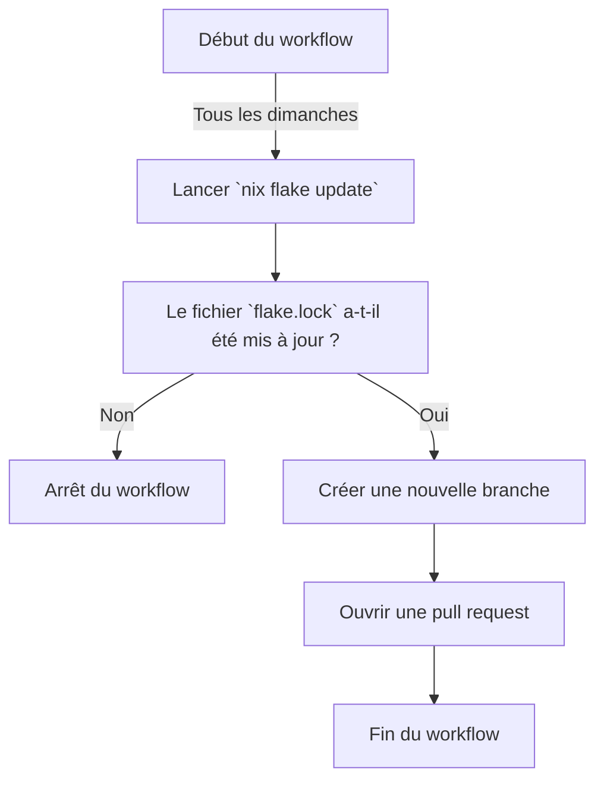

# Qu'est-ce qu'un workflow ? 

Un **workflow** est un mécanisme permettant d'*<u>exécuter des actions après détection d'un événement</u>*.
Ce sont des automatisations qui permettent aux mainteneurs de réduire les tâches répétitives et sujettes aux erreurs.

## Quelles workflow utilisons-nous ? 

Nous avons actuellement un total de quatre workflows sur le dépôt. 

### Mise à jour du flocon 

Le premier workflow se charge de vérifier si le flocon a une mise à jour. 
Il s'exécute tous les dimanches chaque semaine. 

### Test de la configuration 

Ce workflow surveille les modifications arrivant dans les branches `main`, `dev` et les pull requests. 
Pour chaque modifications, le workflow s'exécute et vérifie que les modifications peuvent être construites. 

La durée d'exécution est "aléatoire" dépendamment de la quantité de paquets à construire. 
En moyenne, la durée d'exécution est estimée entre 3 et 12 minutes. 

### Génération d'une image ISO 

Ce workflow génère une image ISO, lorsque le mainteneur le déclenche manuellement.
L'iso générée est téléversé sur github. 

{: .note }
> - La bande passante est d'environ 15Mo/s.
> - Ce workflow doit être exécuté sur une machine "selfhosted", en effet la taille de l'iso associée au cache de construction dépasse la limite autorisé par les machines proposés par github. 

### Génération et déploiement de la documentation

Pour chaque modifications apportés au répertoire `docs`, un workflow se charge de re-générer et déployer une nouvelle version de la documentation, celle que vous consultez ici-même.

## A propos des machines "selfhosted"

Github fournit des "machines" appelés **runner** gratuitement pour effectuer des actions, cependant ces machines ont entre autre des limites de stockages. 
Nous avons également la possibilité d'ajouter des machines "selfhosted" (auto-herbergés) qui peuvent être mise à disposition. 

Nous avons mis à disposition un **docker-compose** pour déployer une machine.

{: .note }
> - Une "machine" (runner) peut effectuer qu'une seule *action* en même temps.
> - Il est nécessaire d'ajouter un "token" fournis par l'organisation GLF pour permettre la connexion d'un runner au dépôt.
> - Puisque le runner est exécuté via github, il est possible de déployer plusieurs instances avec un seul token.
> - Avec docker, il est possible de limiter le pourcentage d'utilisation des coeurs du cpu et/ou de la RAM. 

