{: .todo }
> - Mettre les éléments liés à l'installation dans un sous-groupe "Installation".
> - Instruction pour tester le checksum.
> - Spécifier comment ouvrir le "boot order" (voir tableau : https://www.malekal.com/liste-touches-acces-bios-boot-menu-constructeur/).
> - Fournir des instructions à propos du dualboot.
> - Fournir des explications sur comment utiliser un client torrent.

{: .in-progress }
> Cette page est en travaux et peut être incomplète.

#  Pré-requis

-  Une clé USB d'une capacité minimale de 8Go.
-  [Balena Etcher](https://etcher.balena.io/#download-etcher)

	{: .warning }
	>Nous vous recommandons l'utilisation de balena etcher à la place de ventoy lors du flash de l'iso.
	> L'utilisation de ventoy semble parfois bloquer l'iso d'installation à "l'étape 1" du boot, ce n'est pas systématique ni spécifique à GLF-OS.

-  Une image ISO GLF, téléchargeable via [torrent](https://github.com/GLF-OS/Nixos-by-GLF/releases/download/release/glf-os.torrent) ou [directement](https://kdrive.infomaniak.com/app/share/280110/669a1cd6-21fd-4c5c-9ba0-c2f13b7bb18e).

	{: .info }
	> L'hébergeur du lien vers l'iso a une limite de **100 téléchargements par heure**.

-  Un ordinateur répondant à la [configuration minimale](./minimalConfiguration.html).
-  Une connexion internet.
	
##  Vérification du Checksum (Optionnel mais recommandé)

1. Téléchargez le fichier de checksum depuis l'un des liens de téléchargement.
2. Utilisez un outil de vérification de checksum pour comparer le fichier téléchargé avec le checksum fourni.

##  Rendre l'USB bootable

1. **Branchez votre USB** : Insérez la clé USB dans votre ordinateur.
2. **Ouvrez Balena Etcher** : Lancez l'application Balena Etcher.
3. **Sélectionnez l'ISO** : Cliquez sur **Flash from file**, puis sélectionnez l'ISO GLF-OS.
4. **Sélectionnez la clé USB** : Cliquez sur **Select target**, puis choisissez votre clé USB.
5. **Flashez l'ISO** : Cliquez sur **Flash!** et attendez la fin de l'opération.

À présent, vous êtes prêt à installer GLF-OS. 🎉

##  Installation

{: .info }
> - GLF-OS ne prend pas en charge `secureboot` pour le moment, vous devrez le désactiver avant l'installation auquel cas, vous aurez des difficultés à démarrer l'iso d'installation.
> - Les systèmes BIOS (legacy) et UEFI sont pris en charge.

###  Démarrage depuis l'USB

1. **Redémarrez votre ordinateur** : Éteignez puis rallumez votre ordinateur.
2. **Accédez au menu de démarrage** : Appuyez sur la touche correspondante à votre constructeur pour accéder au menu de démarrage (voir [tableau des touches](https://www.malekal.com/liste-touches-acces-bios-boot-menu-constructeur/)).
3. **Sélectionnez votre clé USB** : Choisissez votre clé USB comme périphérique de démarrage.
   
###  Configuration initiale

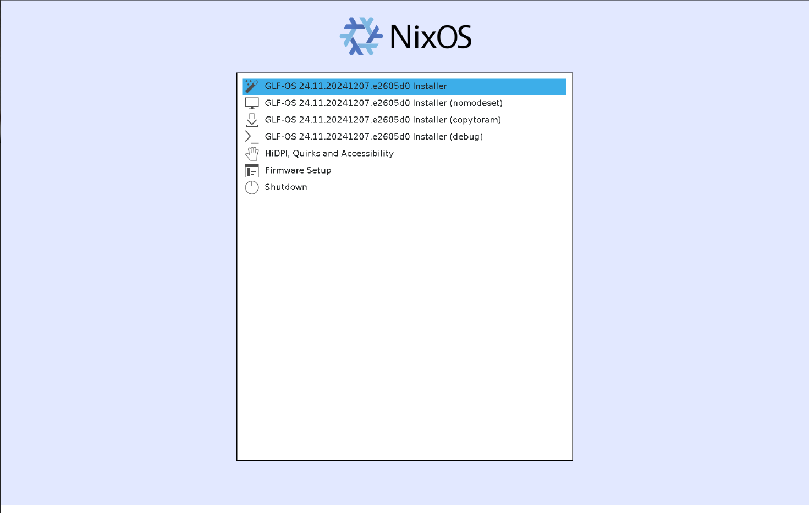
1. **Menu de démarrage** : Un menu apparaît. Restez sur la première option. Si vous avez plus de 16Go de RAM, vous pouvez charger l'ISO dans la mémoire RAM avec l'option **copytoram**.
2. **Connexion Internet** : Si vous utilisez le Wi-Fi, connectez-vous en cliquant en haut à droite de l'écran, puis sélectionnez "Wi-Fi" et connectez-vous à votre réseau.

###  Assistant d'installation

{: .screen }
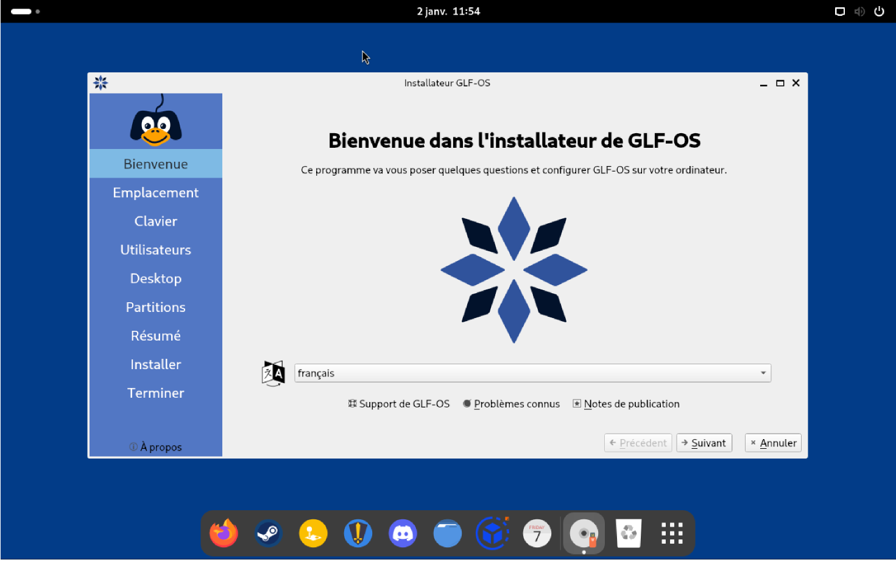
**Langue** : Sélectionnez votre langue.

{: .screen }
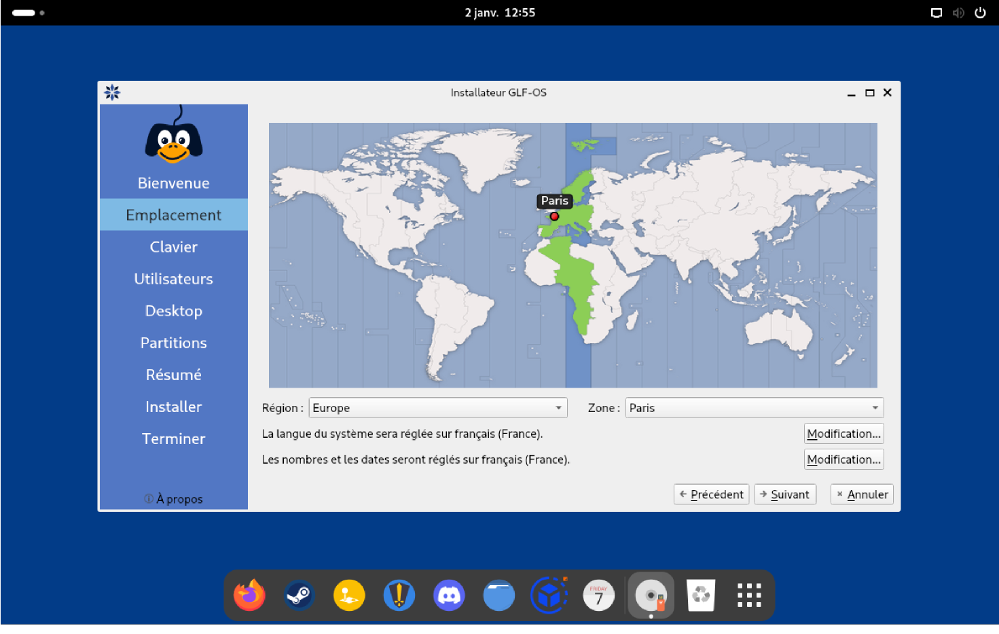
**TimeZone**: Sélectionnez votre emplacement pour définir le fuseau horaire.

{: .screen }
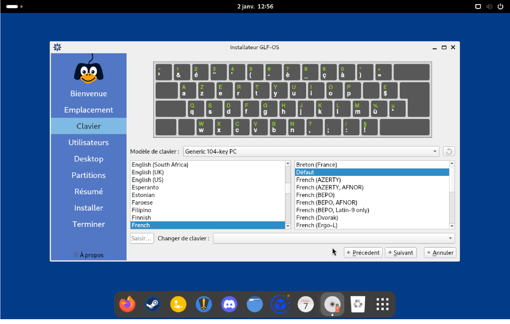
**Clavier** : Sélectionnez la disposition de votre clavier.

{: .screen }
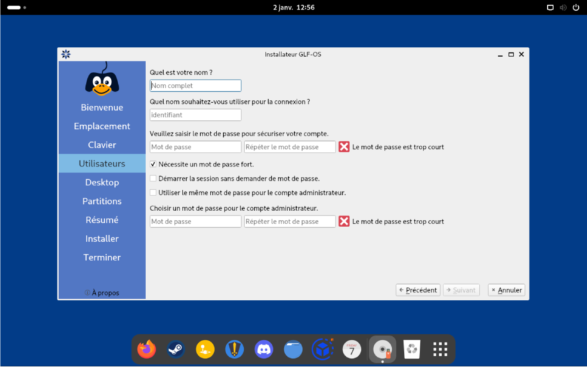
**Informations utilisateur** : Remplissez les informations relatives à votre utilisateur.

{: .screen }
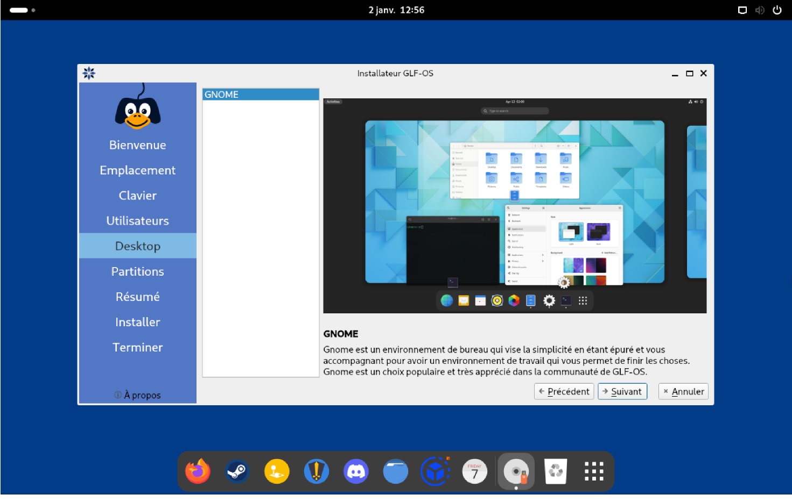
**Environnement de bureau** : Sélectionnez l'environnement de bureau GNOME.

{: .screen }
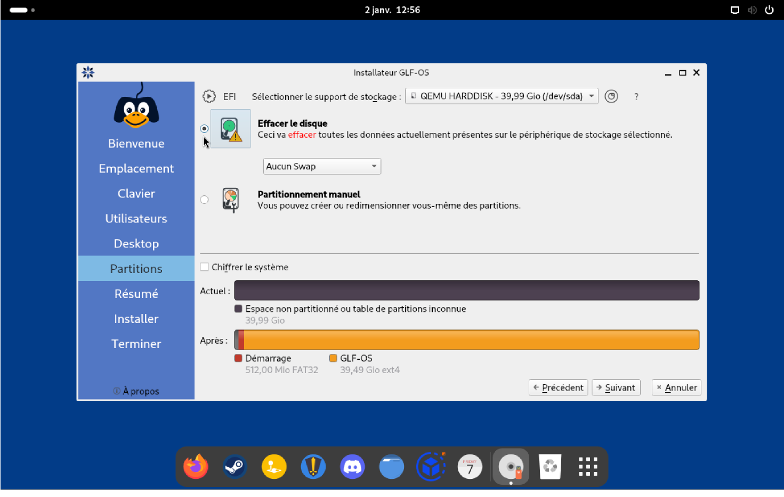
**Partitionnement** : Cliquez sur "Effacer le disque".

{: .screen }
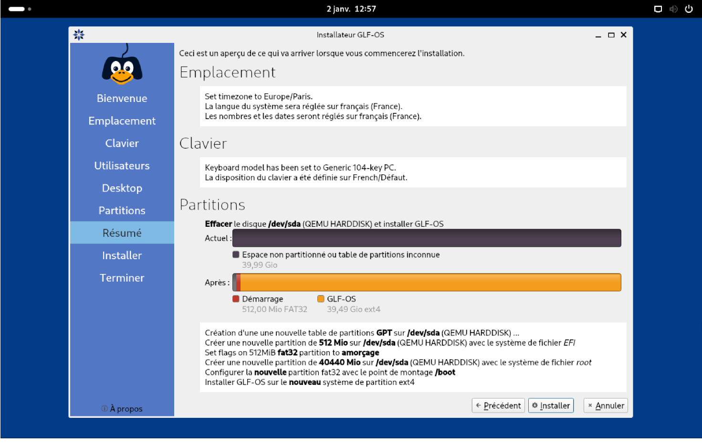
**Lancement de l'installation** : Cliquez sur "Installer".

{: .screen }
> 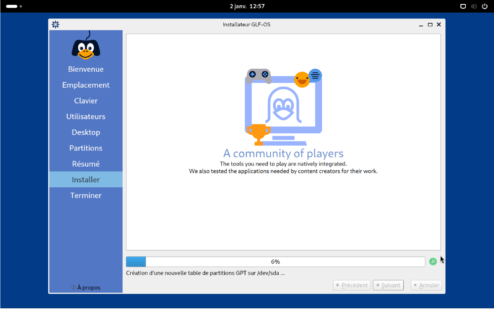
> - La barre de chargement restera *bloqué* un moment à 46%, c'est normal. Cliquez sur la loupe en bas à droite pour voir les détails de l'installation.

{: .screen }
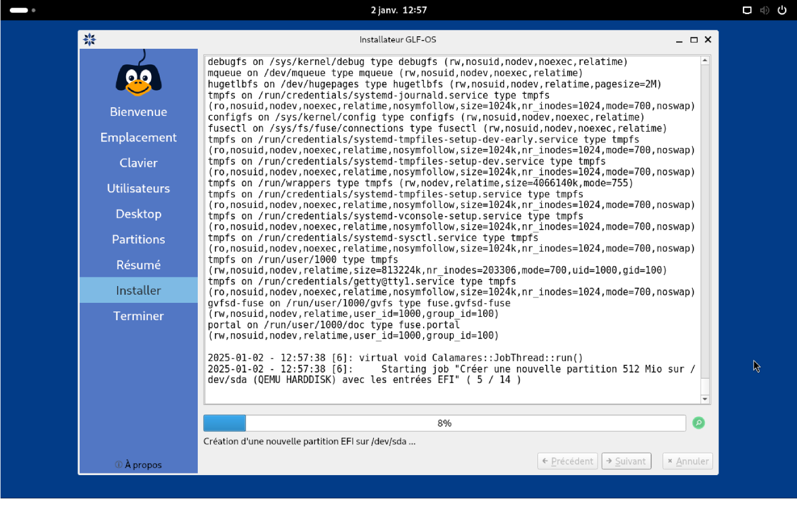

{: .screen }
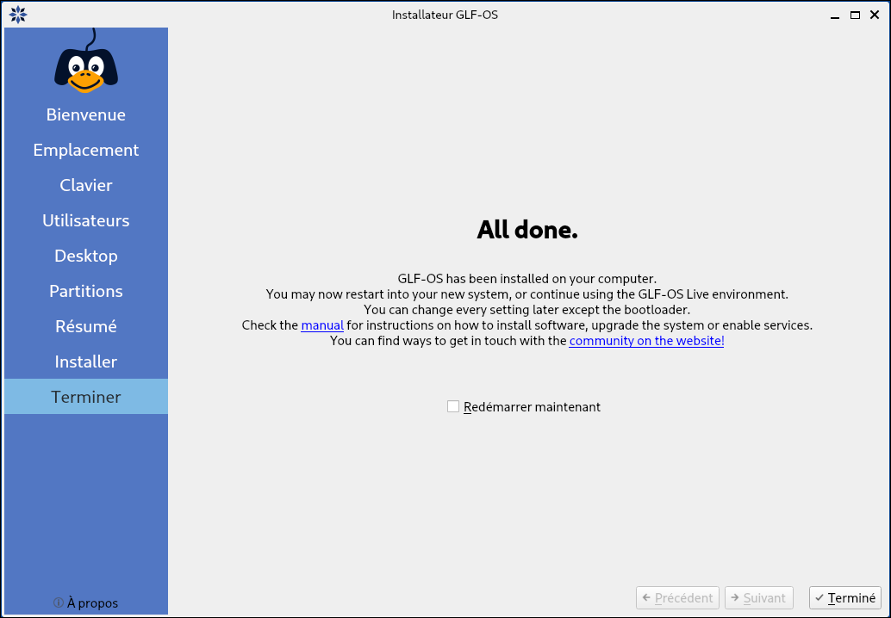

###  Finalisation

1. **Redémarrage** : À la fin de l'installation, redémarrez votre ordinateur.
2. **Retirez la clé USB** : Après l'apparition d'un écran noir, retirez la clé USB.

Félicitations, vous avez installé GLF-OS avec succès ! 🎉
